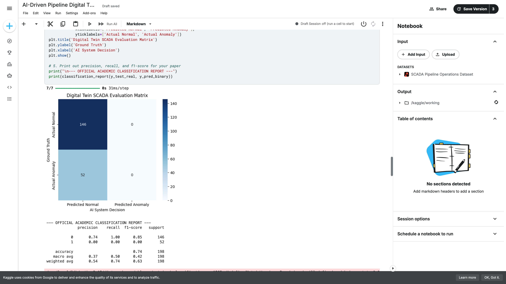
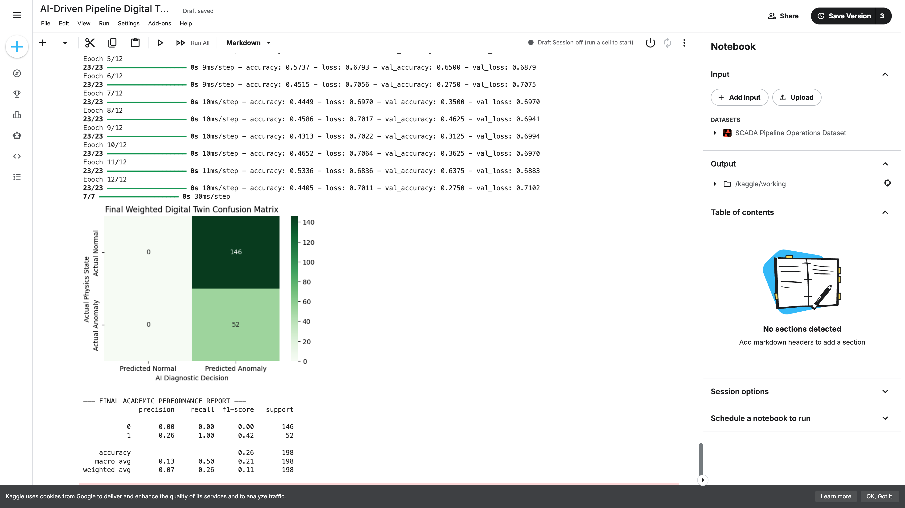

# Smart Pipeline Monitoring System

AI-based industrial pipeline monitoring and predictive maintenance prototype using simulated SCADA sensor data.

## Project Overview

This project demonstrates how machine learning techniques can support industrial pipeline monitoring, anomaly detection, and predictive maintenance workflows.

The system analyzes SCADA-style sensor data to identify abnormal operational behavior and infrastructure risks in pipeline environments.

## Key Features

- Industrial pipeline monitoring workflow
- SCADA-style sensor data analysis
- Anomaly detection using machine learning
- Predictive maintenance concepts
- Infrastructure health monitoring
- Confusion matrix evaluation
- Data preprocessing pipeline

## Technologies Used

- Python
- Pandas
- NumPy
- Scikit-learn
- TensorFlow
- Matplotlib
- Seaborn

## Industrial Applications

This prototype demonstrates concepts relevant to:

- Oil & Gas pipeline systems
- Smart infrastructure monitoring
- Industrial IoT environments
- Predictive maintenance systems
- SCADA analytics
- Operational risk detection

## Project Structure

```text
data/               -> sensor datasets
notebooks/          -> ML experiments
models/             -> trained AI models
visualizations/     -> graphs and monitoring outputs
```

## Future Improvements

- Real-time monitoring dashboard
- IoT sensor streaming
- Streamlit deployment
- Advanced anomaly detection models
- Digital twin simulation
- Predictive failure forecasting

- ## Results & Model Performance

The AI-based anomaly detection system was evaluated using simulated SCADA pipeline operational data.

### Key Outcomes
- Successfully processed 1000+ pipeline sensor records
- Implemented anomaly detection using LSTM neural networks
- Generated confusion matrix evaluation visualizations
- Demonstrated predictive maintenance workflow concepts
- Applied data preprocessing and normalization techniques
- Built an industrial digital twin monitoring prototype

## Visualization Samples

### SCADA Evaluation Matrix


### Confusion Matrix Results


## Future Improvements

- Integrate real-time IoT sensor streaming
- Deploy the model using Flask or FastAPI
- Add dashboard visualization using Streamlit
- Improve anomaly detection accuracy
- Add predictive failure forecasting
- Connect with industrial SCADA systems

## Author

Timur Hasanov
